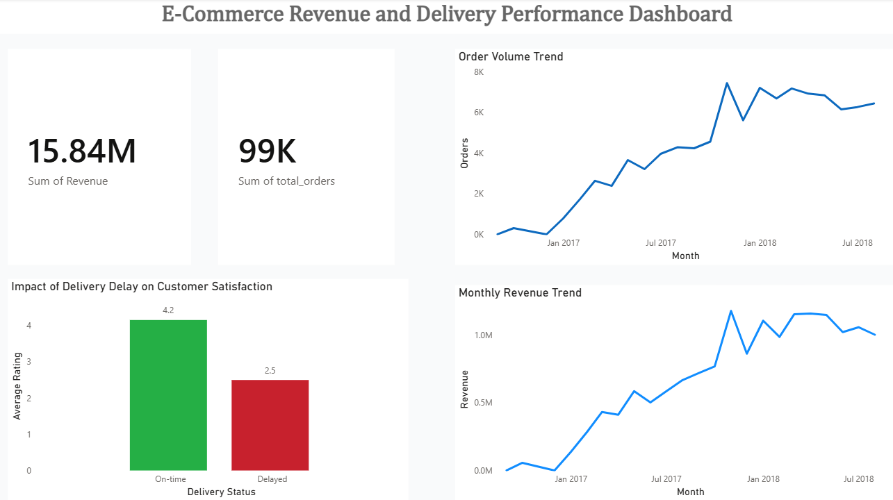
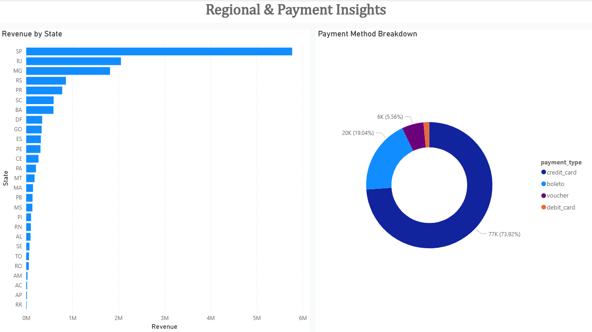

# 🛒 E-Commerce Sales & Delivery Performance Analysis

Analysed 99,000+ orders from the Olist Brazilian e-commerce 
dataset to uncover revenue trends, delivery performance, 
and the impact of delays on customer satisfaction.

**Tools:** MySQL · Power BI  
**Dataset:** [Olist Brazilian E-Commerce — Kaggle](https://www.kaggle.com/datasets/olistbr/brazilian-ecommerce)

---

## 📊 Dashboard

### Page 1 — Revenue & Delivery Overview



### Page 2 — Regional & Payment Insights


---

## 🎯 Business Questions Answered

- What is the monthly revenue and order volume trend?
- How do delivery delays impact customer review scores?
- Which states generate the most revenue?
- What payment methods do customers prefer?

---

## 🔍 Key Findings

- Total revenue: **R$ 15.84M** across 99,000+ orders
- São Paulo generated **R$ 5.77M** — highest revenue state
- RJ second at **R$ 2.06M**, MG third at **R$ 1.82M**
- On-time deliveries averaged a review score of **4.2**
- Delayed deliveries averaged a review score of **2.5**
- Credit card was the dominant payment method at **73.92%**
- Order volume peaked at 8K orders per month in early 2018

---

## 🛠 What Was Done

### Data Cleaning — MySQL
- Created separate raw and clean tables to preserve 
  original data at every stage
- Handled encoding corruption across 4000+ city names 
  — fixed UTF-8 characters misread as Latin-1
- Removed exact duplicate rows using ROW_NUMBER() 
  window function partitioned by all columns
- Resolved coordinate fan-out by averaging lat/lng 
  per zip code — collapsed 157 coordinates for one 
  zip into a single representative point
- Validated datetime logic — flagged and nullified 
  carrier dates that appeared after customer 
  delivery dates
- Cross-checked payment totals from payments table 
  against order item values to identify mismatches
- Standardised city names across sellers and customers 
  using systematic REPLACE on root characters

### Analysis — MySQL
- Monthly revenue and order volume trends using 
  DATE_FORMAT and aggregations
- Delivery performance analysis using CASE statements 
  to classify on-time vs delayed orders
- Customer satisfaction impact measured by joining 
  orders and reviews tables
- State level revenue analysis joining orders, 
  order items and customers tables
- Payment method breakdown by transaction volume 
  and total value

### Visualisation — Power BI
- KPI cards for total revenue and total orders
- Bar chart showing review score impact of delivery delays
- Line charts for monthly revenue and order volume trends
- Horizontal bar chart for revenue by state
- Donut chart for payment method breakdown

---

## 📁 Repository Structure

```
Ecommerce-analysis/
│
├── images/
│   ├── Dashboard1.png        ← Revenue & Delivery Overview
│   └── Dashboard2.png        ← Regional & Payment Insights
├── Ecommerce Project.sql     ← Data cleaning and analysis queries
├── Ecommerce_final_project.pbix  ← Power BI dashboard file
└── README.md
```

---

## 💡 Key Decisions Documented

- **Why AVG coordinates per zip?** Zip codes cover 
  geographic areas, not single points. Averaging gives 
  a centroid suitable for regional analysis without 
  losing zip-level granularity.
- **Why keep raw tables untouched?** Preserves source 
  of truth — any cleaning mistake can be recovered 
  by restarting from raw data.
- **Why set ambiguous city codes to NULL?** Values like 
  'sp' could represent any city in São Paulo state — 
  assuming sao paulo would have introduced incorrect 
  data into regional analysis.
